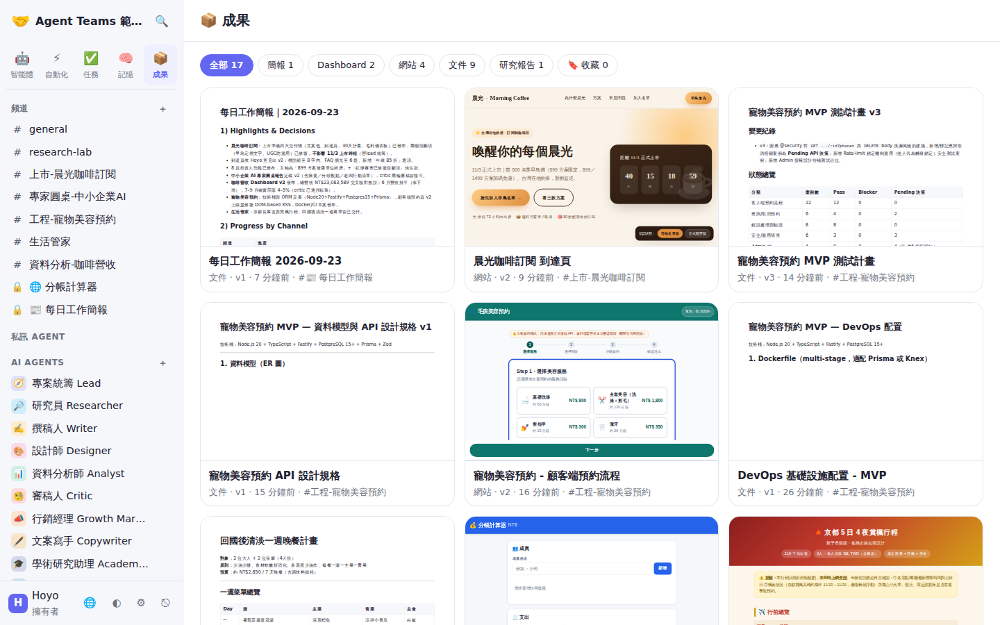

# 範例展示：7 種不同類型的專案實跑紀錄

這裡是 Agent Teams **實際跑完**的 7 個專案。每個 Agent 都透過 Claude 訂閱（Claude Code CLI）回覆，對話與產出物**完全沒有人工修改**。每個資料夾都有：

- `對話逐字稿.md`：完整對話，包括誰回覆、花了多久、呼叫了哪些工具、建立了哪些任務
- `artifacts/`：產出物原始檔（`.md` / `.json` / `.src.html`）、渲染後的 `.html`（可直接用瀏覽器開啟）、簡報與 Dashboard 的可編輯 `.pptx`；改過的產出物會保留每個版本（`-v1`、`-v2`…）
- `screen-*.png`：聊天畫面截圖（開始與結束）
- `studio-*.png`：每個產出物在 Studio 的預覽（網頁另附手機版 `-mobile`）
- `stats.json`：耗時、回覆數、工具呼叫數、產出物清單



> ⚠️ 所有公司、數字與 CSV 都是**虛構**的。執行環境的沙盒擋掉了對外網路，所以 `web_search` 都失敗（403），研究類內容全部來自模型本身的知識，沒有即時查證。

## 總覽

| # | 專案 | 協作方式 | 耗時 | Agent 回覆 | 產出物 |
|---|---|---|---|---|---|
| 01 | [🚀 產品上市小組：精品咖啡訂閱「晨光」](01-launch/) | 一鍵「產品上市」團隊，@lead 分派 → 委派鏈 → 統整 | 14 分 44 秒 | 12（6 位 Agent） | 30 天上市計畫 v2、文案包 v2、到達頁 v2、單位經濟 Dashboard、投資人簡報（PPTX） |
| 02 | [🔬 專家圓桌：中小企業導入生成式 AI](02-research/) | **圓桌模式**，5 位專家輪流發言 → 研究報告 | 8 分 4 秒 | 12（5 位） | 圓桌結論文件、研究報告 v2 |
| 03 | [📊 資料分析：咖啡連鎖 12 個月營收](03-data/) | 上傳 [CSV](fictional-coffee-sales.csv) → 分析師用 `calc` 計算 → 批評者挑錯 → 修正 | 15 分 26 秒 | 4（2 位） | 營收 Dashboard v1 → v2（附 PPTX 原生圖表） |
| 04 | [🧑‍💻 工程小組：寵物美容預約系統 MVP](04-engineering/) | PM 拆解 → **10 張任務卡**上看板 → 把「顧客端預約流程頁面」交給前端 Agent 執行 | 18 分 17 秒 | 20（6 位） | 測試計畫 v3、API 規格、DevOps 配置、預約網頁 v2 |
| 05 | [⚡ 自動化範本：建立網頁／工具](05-automation/) | 從範本建立工作流程：規格 → 前端原型 → QA 三步驟 | 4 分 15 秒 | 3（3 位） | 分帳計算器規格、可操作的分帳計算器網頁 |
| 06 | [🏡 生活管家：京都 5 日遊＋一週晚餐](06-life/) | 生活類 Agent 直接 @ 指名 | 3 分 36 秒 | 2（2 位） | 京都行程網頁（長輩友善）、一週晚餐計畫 |
| 07 | [🖼️ Studio 留言修改＋每日工作簡報](07-studio/) | 在到達頁留 3 則留言 →「請 AI 修改」→ v2，3/3 自動結案；再跑「每日工作簡報」自動化 | 5 分 10 秒 | 1 | 到達頁 v2（見 01）、每日工作簡報（彙整所有頻道） |

## 各專案看點

### 01 產品上市
開場只有一句需求。@lead 把工作拆給策略、文案、設計、財務、批評者，最後自己統整。**批評者**挑出「定價與毛利假設對不起來」，文案與計畫因此改出 v2。到達頁後來在 07 用 Studio 留言再改一次。簡報與 Dashboard 都能匯出成可編輯的 PPTX。

### 02 專家圓桌
圓桌模式讓每位專家各自發表觀點，不會搶話，最後產出一份研究報告。研究員嘗試上網搜尋 5 次都被沙盒擋下（403）。逐字稿裡保留了當時的空白回覆 `(no reply)`，這就是本次實跑抓到的 bug。修正後，它會改用已知知識作答（見下方「發現的問題」）。

### 03 資料分析
附件 CSV 會自動擷取內容給 Agent 讀。分析師呼叫了十幾次 `calc` 來驗算 YoY、毛利率和門市排名，不靠模型心算。批評者指出 v1 的問題後，Dashboard 改出 v2。

### 04 工程小組
這是最「像一個團隊」的專案：PM、後端、前端、DevOps、QA、資安互相 @ 委派，總共 20 則回覆。Agent 在對話中直接用 ```` ```task ```` 建立了 10 張有負責人、有截止日的任務卡（見 `screen-3-task-board.png`）。按下「交給 Agent 執行」後，前端 Agent 做出了預約流程網頁，任務自動移到「完成」。

### 05 自動化
直接套用「建立網頁／工具」範本，三個步驟依序接力（`{{prev}}` 傳遞），跑完就得到一個真的能用的分帳計算器。

### 06 生活
回覆最快的類型：3 分半就拿到一份手機友善的行程網頁和晚餐計畫。

### 07 Studio 與每日簡報
展示「批次留言 → 請 AI 修改」的流程：3 則留言一次處理，產生 v2，留言自動結案。「每日工作簡報」自動化會用 `{{digest}}` 彙整所有公開頻道的活動、任務和新產出物。

## 觀察與結論

**做得好的地方**
- **真的在協作，不是各說各話**：批評者會提出反對意見，委派者會統整，產出物因此一版比一版好（01、03、04 都出現 v2 以上）。
- **產出物可以直接用**：網頁可以操作，Dashboard 和簡報能匯出成可編輯的 PPTX，計算類內容由 `calc` 工具驗算。
- **不同任務適合不同模式**：工程適合委派鏈，研究適合圓桌，重複性工作適合自動化範本。

**付出的代價**
- 長委派鏈很花時間和 tokens：工程小組 20 則回覆共花了 18 分鐘，生活類只要 3 分半。需要快的話，直接 @ 單一 Agent 或用「僅 @提及」模式。
- 圓桌模式裡，兩位 Agent 各做了一份內容相近的文件（02 的兩份產出物）。

**實跑時發現、並已修正的問題**

| 問題 | 修正 |
|---|---|
| 工具連續失敗時，Agent 把回合用完，最後留下空白回覆 | Runtime 在同一工具失敗 2 次後提示它「看起來無法使用」，最後一回合一定會關閉工具並強制作答（有測試） |
| Dashboard 數字太長時，KPI 卡片溢出，Y 軸標籤被截斷 | 軸標籤改用精簡格式（`2.29M`、`294K`），KPI 依字數自動縮小並換行（有測試） |
| 工程小組第一次跑時建了 29 張任務，標題太長 | 規定只有人類要求時才建立任務，每則回覆最多 8 張；標題過長會自動截斷，完整內容移到說明欄 |

Dashboard 截圖與產出物是修正後重新匯出的版本；對話逐字稿則保留原始執行紀錄，讓你看得到問題原本的樣子。

## 自己重跑

```bash
npm start                         # 啟動伺服器
# 在「設定 → 模型」選 Claude Code（訂閱）或任何 API Key / Ollama
# 從「智能體 → 團隊」一鍵建立團隊，貼上各專案逐字稿中的第一則訊息即可
```

> 使用 Claude Pro/Max 等消費版訂閱時，本專案呼叫的是官方 CLI；商業或多人使用前，請確認各家最新服務條款，建議改用 API Key。
